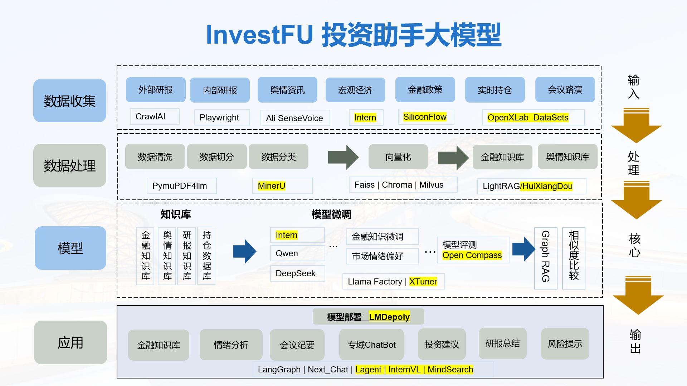

# InvestFU

## 🗂️ 目录
- [前言](#前言)
- [技术架构](#技术架构)
- [使用指南](#使用指南)
- [使用指南](#使用指南)
    - [文档结构](#文件结构)
    - [环境准备](#环境准备)
    - [数据集制作](#数据集制作)
    - [模型训练](#模型训练)
    - [RAG(检索增强生成)](#rag检索增强生成)
    - [ASR(语音识别)](#ASR(语音识别))
- [开发计划](#开发计划)
    - [初版功能](#初版功能)
    - [后续功能](#后续功能)
- [致谢](#致谢)
- [免责声明](#免责声明)


## 前言

在当今瞬息万变的金融市场中，投资决策的复杂性与日俱增。随着信息量的激增和市场环境的不断变化，传统的投资研究方式已难以满足高效、准确的决策需求。因此，构建一个智能投资研究系统已成为金融机构提升竞争力的重要举措。

### 投资研究智能系统的帮助

投资研究智能系统通过整合大数据和人工智能技术，可以为投资经理提供以下支持：

1. **信息整合与分析**：系统能够快速汇聚来自不同渠道的信息，包括财务报表、宏观经济数据、行业动态和舆情分析，帮助研究人员全面了解市场状况。

2. **实时风险监控**：借助先进的算法，智能系统可以实时监测市场变化和持仓资产的风险，及时发出预警，助力投资经理做出迅速反应。

3. **智能决策支持**：通过数据挖掘和模式识别，系统可以提供基于历史数据的投资建议，帮助投资团队识别潜在的投资机会与风险。

4. **提高工作效率**：自动化的数据处理和报告生成减少了人工工作量，使研究人员能将更多时间投入到深度分析和战略思考中。


## 技术架构



构建**金融领域模型**,使用Internlm2-chat-7b 💥通过xtuner进行SFT微调，部署集成了LMDeploy加速推理 🚀，支持 RAG 检索增强生成 💾，为金融领域大模型提供丰富的知识库组。

### 构建金融领域模型数据集和微调(Fine-tune)

使用的数据集在datasets文件夹下，感谢HuggingFace提供的金融术语数据集。
使用Xtuner微调工具+qlora的方法构建新的**金融领域模型**，也支持直接通过LMDeploy接入现有的llm进行对话。

### RAG技术

目前支持Doc、Docx、Excel、csv、PDF、MD文件。

针对PDF文件，本项目通过使用PymuPDF4llm将pdf文件转换成markdown结构化格式。

针对Doc\Docx文件，本项目通过使用Py2Doc将文档转成转换成json格式。

最终输出的结构化数据，通过bce-embedding-base_v1和bce-reranker-base_v1模型Embedding到向量数据库。

## 使用指南

### 文件结构

```bash
InvestFU/
│
├── assets                   # 素材
├── configs                  # 配置
├── data                     # 内外部数据
├── datasets                 # 预训练数据集
├── deploy                   # 发布
├── docs                     # doc文档
├── evaluation               # 验证集
├── rag                      # RAG
├── scripts                  # 处理数据脚本
├── src                      # 项目代码
├── tools                    # 工具类
├── xtuner                   # xtuner微调
├── README.md                # README.md
└── requirements.txt         # 使用pip安装的依赖
```

### 环境准备

```shell
# 创建虚拟环境
conda create -n invest python=3.10 -y

# 激活虚拟环境（注意：后续的所有操作都需要在这个虚拟环境中进行）
conda activate invest

# 安装一些必要的库
conda install pytorch==2.1.2 torchvision==0.16.2 torchaudio==2.1.2 pytorch-cuda=12.1 -c pytorch -c nvidia -y
# 安装其他依赖
pip install -r requirements.txt
```


### 数据集制作

- 从上交所获取股票年报：python handle_ssc.py
- 从HuggingFace数据集中获取中国平安相关信息：python handle_jsonl.py
- 从东方财富获取舆情新闻：python handle_eastmoney.py
- 从巨潮资讯获取事件信息：python handle_cninfo.py
- 从沧海数据通过api获取行情数据等：python handle_canghai_api.py

处理数据文件：目前支持Doc、Docx、Excel、csv、PDF、MD、json文件，处理后文件主要用于模型微调数据集和知识库构建
微调数据集结构：
``` 
[
    {
        "conversation": {
            "input": "问题：601318的全称、A股简称、法人、会计师事务所及董秘是？",
            "output": "对于股票代码为 601318 的公司，以下是您请求的信息：全称：中国平安保险（集团）股份有限公司 (China Ping An Insurance (Group) Co., Ltd.)A股简称：中国平安法人：马明哲（董事长）会计师事务所：普华永道中天会计师事务所 (PwC Zhong Tian)董秘：姚波（董事会秘书）请注意，这些信息可能会随时间而变化，尤其是法律顾问和董秘等职位。为了获得最准确和最新的信息，建议查阅中国平安最近发布的官方公告或年度报告。这些文件通常可以在公司的官方网站或者上海证券交易所的官方网站上找到。"
        }
    },
    ...
]
```
[数据处理](README_data.md)


### 模型训练

基于InternLM2.5-7B-Chat基础模型，我们准备了SFT的微调数据，训练一个针对财报场景的私有模型。

[XTuner手册](./xtuner/README_xtuner.md)

命令行直接如下操作：

**LoRA+deepspeed训练**

```
#指令微调
xtuner train ./config/internlm2_5_chat_7b_lora_pingan.py --work-dir ./work_dirs/assistTuner
xtuner train ./config/internlm2_5_chat_7b_lora_pingan.py --work-dir ./work_dirs/assistTuner --deepspeed deepspeed_zero1(使用deepspeed加速)
```

### RAG(检索增强生成)

默认`data`目录为txt数据源目录，开启RAG后，会使用bce-embedding-base_v1自动将`data`目录下的txt数据转为换chroma向量库数据，存放在`rag/chroma `目录下（如果该目录下已有数据库文件，则跳过数据库创建），然后使用bce-reranker-base_v1对检索到的信息重排序后，将问题和上下文一起给模型得到最终输出。`rag/simple_rag.py`里是一个简单的demo，参数配置见`configs/rag_cfg.yaml`。

[金融知识库](README_rag.md)


### ASR(语音识别)
通过FunASR使用SenseVoiceSmall模型做音频语音识别。

[语音识别处理](README_asr.md)


 
## 开发计划

### 初版功能

- [x] 收录并解析各渠道数据，训练金融领域模型

- [x] 使用RAG支持财报、研报、行情、舆情事件，搭建知识库

- [x] 基于OpenXLab使用LMDepoly实现初版demo部署

### 后续功能

- [ ] 加入语音多模态，如ASR（用户语音输入）、TTS（会议纪要）

- [ ] 加入实时持仓的管理，接入智能投资系统

- [ ] 对接内部风控系统，提高模型问答的安全性


## 致谢

非常感谢以下这些开源项目给予我们的帮助：

- [InternLM](https://github.com/InternLM/InternLM)
- [Xtuner](https://github.com/InternLM/xtuner)
- [Imdeploy](https://github.com/InternLM/lmdeploy)
- [InternlM-Tutorial](https://github.com/InternLM/Tutorial)
- [HuixiangDou](https://github.com/InternLM/HuixiangDou)
- [Streamer-Sales](https://github.com/PeterH0323/Streamer-Sales)

最后感谢上海人工智能实验室推出的书生·浦语大模型实战营，为我们的项目提供宝贵的技术指导和强大的算力支持！

## 免责声明

**本项目相关资源仅供学术研究之用，严禁用于商业用途。** 使用涉及第三方代码的部分时，请严格遵循相应的开源协议。模型生成的内容受模型计算、随机性和量化精度损失等因素影响，本项目不对其准确性作出保证。对于模型输出的任何内容，本项目不承担任何法律责任，亦不对因使用相关资源和输出结果而可能产生的任何损失承担责任。本项目由个人及协作者业余时间发起并维护，因此无法保证能及时回复解决相应问题。
