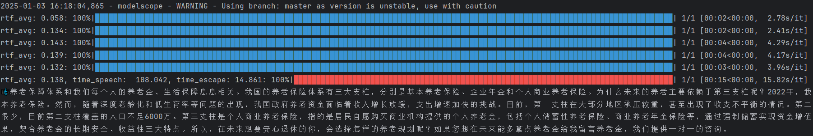

# ASR
FunASR + SenseVoiceSmall模型

## 音频提取
如果本地直接有音频文件，可跳过此步。

如果是在线视频提取音频文件，使用 `yt-dlp` 工具  
```bash
yt-dlp -f "bestaudio" "视频URL" --output "输出文件路径"
```
代码见 tools/download_audio.py。

## 音频识别
输入音频文件，通过FunASR调用SenseVoiceSmall模型进行识别输出音频文本。
```py
from funasr import AutoModel
from funasr.utils.postprocess_utils import rich_transcription_postprocess


def asr_sv(input_audio):
    model_dir = "iic/SenseVoiceSmall"

    model = AutoModel(
        model=model_dir,
        vad_model="fsmn-vad",
        vad_kwargs={"max_single_segment_time": 30000},
        device="cuda:0",
    )

    res = model.generate(
        input=input_audio,
        cache={},
        language="auto",  # "zn", "en", "yue", "ja", "ko", "nospeech"
        use_itn=True,
        batch_size_s=60,
        merge_vad=True,
        merge_length_s=15,
    )
    text = rich_transcription_postprocess(res[0]["text"])
    return text
```

识别示例：  

