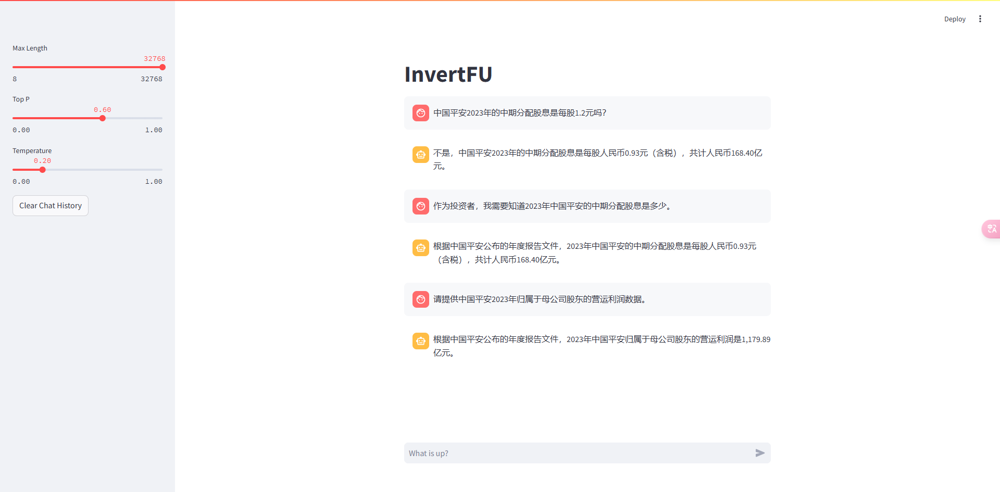

# Lora微调模型

## 背景

基于InternLM2.5-7B-Chat基础模型，我们准备了SFT的微调数据，训练一个针对财报场景的私有模型。

请从Github下载InvestFU项目，InvestFU项目根目录做为整个XTUNER案例的根目录，请根据自己电脑上的实际目录进行调整。

## 数据准备

我们基于中国平安2023年的年度报告，准备了一些问答对，存放在data/annual_report目录下的平安测试数据集.xlsx。

通过handle_xtuner_datasets.py脚本，对数据进行清洗及格式转换的处理，生成符合internlm模型的jsonl格式数据。

运行方式如下：
```shell
cd xtuner
python handle_xtuner_datasets.py
```
生成的jsonl文件保存在xtuner/finetune/data/pingan_xtuner_all.jsonl。数据如下：
```doctest
{"conversation": [{"system": "你是一个金融分析师，你根据给定的财报数据，回答用户的问题。", "input": "中国平安在2023年中期分配股息是多少？", "output": "中国平安在2023年中期已分配股息每股人民币0.93元（含税），共计人民币168.40亿元。"}]}
{"conversation": [{"system": "你是一个金融分析师，你根据给定的财报数据，回答用户的问题。", "input": "2023年中国平安的中期分配股息是多少？", "output": "根据中国平安公布的年度报告文件，中国平安2023年的中期分配股息是每股人民币0.93元（含税），共计人民币168.40亿元。"}]}
{"conversation": [{"system": "你是一个金融分析师，你根据给定的财报数据，回答用户的问题。", "input": "请提供中国平安2023年的中期分配股息数据。", "output": "根据中国平安公布的年度报告文件，中国平安2023年的中期分配股息是每股人民币0.93元（含税），共计人民币168.40亿元。"}]}
{"conversation": [{"system": "你是一个金融分析师，你根据给定的财报数据，回答用户的问题。", "input": "作为投资者，我需要知道2023年中国平安的中期分配股息是多少。", "output": "根据中国平安公布的年度报告文件，中国平安2023年的中期分配股息是每股人民币0.93元（含税），共计人民币168.40亿元。"}]}
{"conversation": [{"system": "你是一个金融分析师，你根据给定的财报数据，回答用户的问题。", "input": "与2022年相比，中国平安2023年的中期分配股息是多少？", "output": "根据中国平安公布的年度报告文件，中国平安2023年的中期分配股息是每股人民币0.93元（含税），共计人民币168.40亿元。与2022年相比，该数据可能有所变化。"}]}
{"conversation": [{"system": "你是一个金融分析师，你根据给定的财报数据，回答用户的问题。", "input": "中国平安2023年的中期分配股息是每股1.2元吗？", "output": "不是，中国平安2023年的中期分配股息是每股人民币0.93元（含税），共计人民币168.40亿元。"}]}
{"conversation": [{"system": "你是一个金融分析师，你根据给定的财报数据，回答用户的问题。", "input": "中国平安在2023年归属于母公司股东的营运利润是多少？", "output": "根据中国平安公布的年度报告文件，中国平安2023年归属于母公司股东的营运利润是1,179.89亿元。"}]}
{"conversation": [{"system": "你是一个金融分析师，你根据给定的财报数据，回答用户的问题。", "input": "2023年中国平安归属于母公司股东的营运利润是多少？", "output": "根据中国平安公布的年度报告文件，中国平安2023年归属于母公司股东的营运利润是1,179.89亿元。"}]}
{"conversation": [{"system": "你是一个金融分析师，你根据给定的财报数据，回答用户的问题。", "input": "请提供中国平安2023年归属于母公司股东的营运利润数据。", "output": "根据中国平安公布的年度报告文件，中国平安2023年归属于母公司股东的营运利润是1,179.89亿元。"}]}
{"conversation": [{"system": "你是一个金融分析师，你根据给定的财报数据，回答用户的问题。", "input": "作为投资者，我需要知道2023年中国平安归属于母公司股东的营运利润是多少。", "output": "根据中国平安公布的年度报告文件，中国平安2023年归属于母公司股东的营运利润是1,179.89亿元。"}]}
{"conversation": [{"system": "你是一个金融分析师，你根据给定的财报数据，回答用户的问题。", "input": "与2022年相比，中国平安2023年归属于母公司股东的营运利润是多少？", "output": "根据中国平安公布的年度报告文件，中国平安2023年归属于母公司股东的营运利润是1,179.89亿元。与2022年度相比，该数据可能有所变化。"}]}
{"conversation": [{"system": "你是一个金融分析师，你根据给定的财报数据，回答用户的问题。", "input": "中国平安2023年归属于母公司股东的营运利润是900.89亿元吗？", "output": "不是，中国平安2023年归属于母公司股东的营运利润是1,179.89亿元。"}]}
{"conversation": [{"system": "你是一个金融分析师，你根据给定的财报数据，回答用户的问题。", "input": "中国平安寿险及健康险业务在2023年的营运ROE是多少？", "output": "根据中国平安公布的年度报告文件，2023年中国平安寿险及健康险业务的营运ROE为32.1%。"}]}
{"conversation": [{"system": "你是一个金融分析师，你根据给定的财报数据，回答用户的问题。", "input": "2023年中国平安寿险及健康险业务的营运ROE是多少？", "output": "根据中国平安公布的年度报告文件，2023年中国平安寿险及健康险业务的营运ROE为32.1%。"}]}
{"conversation": [{"system": "你是一个金融分析师，你根据给定的财报数据，回答用户的问题。", "input": "请提供中国平安寿险及健康险业务2023年营运ROE数据。", "output": "根据中国平安公布的年度报告文件，2023年中国平安寿险及健康险业务的营运ROE为32.1%。"}]}
{"conversation": [{"system": "你是一个金融分析师，你根据给定的财报数据，回答用户的问题。", "input": "作为投资者，我需要知道2023年中国平安寿险及健康险业务的营运ROE是多少。", "output": "根据中国平安公布的年度报告文件，2023年中国平安寿险及健康险业务的营运ROE为32.1%。"}]}
{"conversation": [{"system": "你是一个金融分析师，你根据给定的财报数据，回答用户的问题。", "input": "与2022年相比，中国平安寿险及健康险业务2023年的营运ROE是多少？", "output": "根据中国平安公布的年度报告文件，2023年中国平安寿险及健康险业务的营运ROE为32.1%。与2022年度相比，该数据可能有所变化。"}]}
{"conversation": [{"system": "你是一个金融分析师，你根据给定的财报数据，回答用户的问题。", "input": "中国平安寿险及健康险业务2023年的营运ROE是21.2%吗？", "output": "不是，2023年中国平安寿险及健康险业务的营运ROE为32.1%。"}]}
......
```

## 环境准备
### 步骤 0. 使用 conda 先构建一个 Python-3.10 的虚拟环境
```shell
cd ~
conda create -n xtuner-env python=3.10 -y
conda activate xtuner-env
```

### 步骤 1. 安装 XTuner
```shell
cd xtuner
pip install -r requirements.txt
```
验证安装
```shell
xtuner list-cfg
```

### 步骤 2. 准备基座模型

```markdown
1、可以到huggingface上下载模型。
https://huggingface.co/internlm/internlm2_5-7b-chat


2、使用InternStudio开发机中的已经提供了微调模型，可以直接软链接即可。
本模型位于/root/share/new_models/Shanghai_AI_Laboratory/internlm2_5-7b-chat
使用方式如下：

mkdir xtuner/finetune/models
ln -s /root/share/new_models/Shanghai_AI_Laboratory/internlm2_5-7b-chat xtuner/finetune/models/internlm2_5-7b-chat
```

## 启动微调

本教程已经将改好的config放在了 xtuner/finetune/config/internlm2_5_chat_7b_lora_pingan.py

运行命令进行微调
```shell
cd xtuner/finetune
conda activate xtuner-env

xtuner train ./config/internlm2_5_chat_7b_lora_pingan.py --work-dir ./work_dirs/assistTuner
```

## 权重转换

模型转换的本质其实就是将原本使用 Pytorch 训练出来的模型权重文件转换为目前通用的 HuggingFace 格式文件，那么我们可以通过以下命令来实现一键转换。

我们可以使用 xtuner convert pth_to_hf 命令来进行模型格式转换。

```shell
cd xtuner/finetune/work_dirs/assistTuner

conda activate xtuner-env

# 先获取最后保存的一个pth文件
pth_file=`ls -t xtuner/finetune/work_dirs/assistTuner/*.pth | head -n 1 | sed 's/:$//'`
export MKL_SERVICE_FORCE_INTEL=1
export MKL_THREADING_LAYER=GNU
xtuner convert pth_to_hf ./internlm2_5_chat_7b_lora_pingan.py ${pth_file} ./hf
```

## 模型合并

对于 LoRA 或者 QLoRA 微调出来的模型其实并不是一个完整的模型，而是一个额外的层（Adapter），训练完的这个层最终还是要与原模型进行合并才能被正常的使用。

```shell
cd xtuner/finetune/work_dirs/assistTuner
conda activate xtuner-env

export MKL_SERVICE_FORCE_INTEL=1
export MKL_THREADING_LAYER=GNU
xtuner convert merge xtuner/finetune/models/internlm2_5-7b-chat ./hf ./merged --max-shard-size 2GB
```

## 最终效果

微调完成后，我们可以再次运行 xtuner_streamlit_demo.py 脚本来观察微调后的对话效果。

```shell
cd xtuner
conda activate xtuner-env

pip install streamlit==1.31.0
streamlit run xtuner/xtuner_streamlit_demo.py
```

